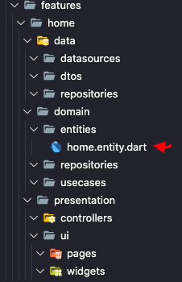
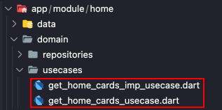
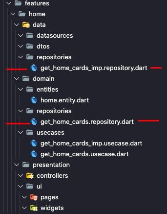
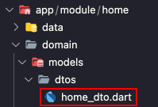
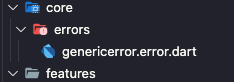

# JS Arch CLI

## Code generator to facilitate development

Get Start:
```bash
dart pub global activate --source path ./RepositoryProject
```

--- 

### Commands:

```bash
# Generate Feature
js_cli g layer complete /lib/src/features/home
```
<details>
<summary>Result</summary>


</details>

--- 

```bash
# Generate Entity
js_cli g entity /lib/src/features/home Home
```
<details>
<summary>Result</summary>

```dart
// home.entitiy.dart 
class HomeEntity {

  HomeEntity();

}
```

</details>

--- 

```bash
# Generate UseCase
js_cli g usecase /lib/src/features/home GetHomeCards
```
<details>
<summary>Result</summary>

```dart
//get_home_cards.usecase.dart
abstract class GetHomeCardsUsecase {
  Future<void>call();
}
```
```dart
//get_home_cards_imp.usecase.dart
import 'get_home_cards.usecase.dart';

class GetHomeCardsImpUsecase implements GetHomeCardsUsecase {
  @override
  Future<void> call() {
    // TODO: implement call
    throw UnimplementedError();
  }
  
}
  
```

</details>

--- 

```bash
# Generate Repository
js_cli g repository /lib/src/features/home GetHomeCards
```
<details>
<summary>Result</summary>

```dart
// domain/repositories/get_home_cards.repository.dart
abstract class GetHomeCardsRepository {
  Future<void>call();
}
```
```dart
// data/repositories/get_home_cards_imp.repository.dart
import '../../domain/repositories/get_home_cards.repository.dart';

class GetHomeCardsImpRepository implements GetHomeCardsRepository {
  @override
  Future<void> call() {
    // TODO: implement call
    throw UnimplementedError();
  }
}
```

</details>

--- 

```bash
# Generate Dto
js_cli g dto /lib/src/features/home Home
```
<details>
<summary>Result</summary>

```dart
// home.dto.dart
import '../../domain/models/entities/home.entity.dart';

class HomeDto extends HomeEntity {

  HomeDto() : super();

}
```

</details>

--- 

```bash
# Generate Error
js_cli g error /lib/src/core/errors Generic  
```
<details>
<summary>Result</summary>

```dart
// generic.error.dart
class GenericError implements Exception {
  final String _message;
  final Exception innerException;

  GenericError(String message, this.innerException) : _message = message;

  String get message => _message;
}
```

</details>

---

```bash

$ js_cli integration
################### Clean Arch CLI ###################
integration with flutter_modular lib
Integration with some external lib?
- flutter_modular
- none

$ js_cli g layer complete ./teste/features/dashboard
################### Clean Arch CLI ###################
generating complete layer....
COMPLETE layer created

$ js_cli g entity ./teste/features/dashboard Viewer
################### Clean Arch CLI ###################
generating usecase Viewer....
Viewer created

$ js_cli g usecase ./teste/features/dashboard getViewer
################### Clean Arch CLI ###################
generating usecase getViewer....
getViewer created

$ js_cli g repository ./teste/features/dashboard getViewer
################### Clean Arch CLI ###################
generating repository getViewer....
getViewer created

$ js_cli g dto ./teste/features/dashboard Viewer
################### Clean Arch CLI ###################
generating dto Viewer....
ViewerDto created

```
---
