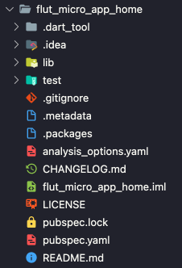
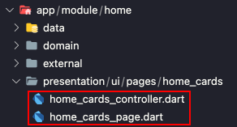
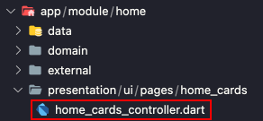
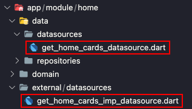
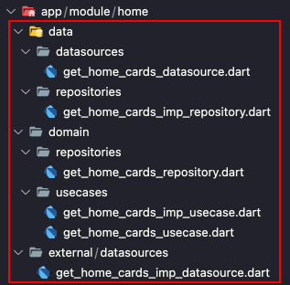
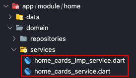

# Flutter Arch CLI

## Gerador de código para facilitar uma arquitetura limpa

###### [Documentação em inglês](https://github.com/jheimes-silveira/ft_cli/blob/master/README.md)

Vamos começar:
```bash
dart pub global activate ft_cli
```

Ou:

```bash
dart pub global activate --source path ./RepositoryProject
```

### Visão Geral

Para tornar mais fácil e intuitivo implementar a Arquitetura _Uncle Bob's Clean Architecture_. Esta CLI fornece a estrutura base, onde irá gerar dinamicamente as Classes conforme mostrado nos exemplos abaixo.

Também podendo ter a vantagem de editar de uma forma facíl e dinâmica atraves da edição de templete e __triggers__ para aplicar __replace__ em algum trexo de código e criar novos arquivos apartir dos comandos.


### Commands:

```bash
ft_cli init 
```

Cria as variaveis configuraveis do seu projeto, gerando uma estrutura básica, onde ira gerar uma pasta `.ft_cli`.

---

```bash
# Generate Micro Frontend
ft_cli mf
```
Selecione o componente que deseja criar e escreva o nome em _snakeCase_.

<details>
<summary>Resultado</summary>

```bash
? Qual componente você deseja criar? › 
❯ micro_app
  micro_commons
  micro_core
  base_app
```


</details>

---

```bash
# Generate Layer
ft_cli g layer lib/app/module/home
# Or
ft_cli g l lib/app/module/home
```
<details>
<summary>Resultado</summary>


</details>

--- 

```bash
# Generate Page
ft_cli g page lib/app/module/home HomeCards
# Or
ft_cli g p lib/app/module/home HomeCards
```
<details>
<summary>Resultado</summary>

```dart
// presentation/ui/pages/home_cards/home_cards_page.dart
import 'package:flutter/material.dart';
import 'home_cards_controller.dart';

class HomeCardsPage extends StatefulWidget {

  @override
  _HomeCardsPageState createState() => _HomeCardsPageState();
}

class _HomeCardsPageState extends State<HomeCardsPage> {
  final GlobalKey<ScaffoldState> scaffoldKey = GlobalKey<ScaffoldState>();

  @override
  Widget build(BuildContext context) {
    return Scaffold(
      key: scaffoldKey,
      appBar: const AppBar(),
      body: const Container(),
    );
  }
}
```
```dart
// presentation/ui/pages/home_cards/home_cards_controller.dart
class HomeCardsController {
  bool loading = false;

  void setLoading(bool value) {
    loading = value;
  }
}
```


</details>

--- 

```bash
# Generate Controller
ft_cli g controller lib/app/module/home HomeCards
# Or
ft_cli g c lib/app/module/home HomeCards
```
<details>
<summary>Resultado</summary>

```dart
// presentation/ui/pages/home_cards/home_cards_controller.dart
class HomeCardsController {
  bool loading = false;

  void setLoading(bool value) {
    loading = value;
  }
}
```


</details>

--- 

```bash
# Generate DataSource
ft_cli g datasource lib/app/module/home GetHomeCards
# Or
ft_cli g d lib/app/module/home GetHomeCards
```
<details>
<summary>Resultado</summary>

```dart
// data/datasources/get_home_cards_datasource.dart
abstract class GetHomeCardsDatasource {
  Future<void> call();
}
```
```dart
// external/datasources/get_home_cards_imp_datasource.dart
import '../../data/datasources/get_home_cards_datasource.dart';

class GetHomeCardsImpDatasource implements GetHomeCardsDatasource {
  @override
  Future<void> call() {
    // TODO: implement call
    throw UnimplementedError();
  }
}
```


</details>

--- 

```bash 
# Generate Repository
ft_cli g repository lib/app/module/home GetHomeCards
# Or
ft_cli g repository lib/app/module/home GetHomeCards
```
<details>
<summary>Resultado</summary>

```dart
// domain/repositories/get_home_cards_repository.dart
abstract class GetHomeCardsRepository {
  Future<void> call();
}
```
```dart
// data/repositories/get_home_cards_imp_repository.dart
import '../../repositories/get_home_cards_repository.dart';

class GetHomeCardsImpRepository implements GetHomeCardsRepository {
  @override
  Future<void> call() {
    // TODO: implement call
    throw UnimplementedError();
  }
}
```

</details>

--- 

```bash
# Generate UseCase
ft_cli g usecase lib/app/module/home GetHomeCards
# Or
ft_cli g u lib/app/module/home GetHomeCards
```
<details>
<summary>Resultado</summary>

```dart
// domain/usecases/get_home_cards_usecase.dart
abstract class GetHomeCardsUsecase {
  Future<void> call();
}
```
```dart
// domain/usecases/get_home_cards_imp_usecase.dart
import 'get_home_cards_usecase.dart';

class GetHomeCardsImpUsecase implements GetHomeCardsUsecase {
  @override
  Future<void> call() {
    // TODO: implement call
    throw UnimplementedError();
  }
}
  
```

</details>

--- 

```bash
# Generate UseCase, Repository and DataSource
ft_cli g usecase lib/app/module/home GetHomeCards -r -d
# Or
ft_cli g u lib/app/module/home GetHomeCards -r -d
```
<details>
<summary>Resultado</summary>


</details>


--- 

```bash
# Generate Service
ft_cli g service lib/app/module/home HomeCards
# Or
ft_cli g s lib/app/module/home HomeCards
```
<details>
<summary>Resultado</summary>

```dart
// domain/services/home_cards_service.dart
abstract class HomeCardsService {
  Future<void> call();
}
```
```dart
// domain/services/home_cards_imp_service.dart
import 'home_cards_service.dart';

class HomeCardsImpService implements HomeCardsService {
  @override
  Future<void> call() {
    // TODO: implement call
    throw UnimplementedError();
  }
}
  
```


</details>

--- 

```bash
# Generate Entity
ft_cli g entity lib/app/module/home Home
# Or
ft_cli g e lib/app/module/home Home
```
<details>
<summary>Resultado</summary>

```dart
// domain/models/entities/home_entity.dart 
class HomeEntity {
  HomeEntity();
}
```

</details>

--- 

```bash
# Generate Dto
ft_cli g dto lib/app/module/home Home
```
<details>
<summary>Resultado</summary>

```dart
// domain/models/dtos/home_dto.dart
import '../../models/entities/home_entity.dart';

class HomeDto extends HomeEntity {
  HomeDto() : super();
}
```

</details>

---

```file
-------------------------- HELPS --------------------------

i, init             Gera os arquivos configuraveis do projeto...
Exemplo: ft_cli init

mf, microfrontend   Seleciona a opção para criação de novos componentes de microfrontend...
Exemplo: ft_cli mf

l, layer            Gera a estrutura de pastas de um modulo...
Exemplo: ft_cli g l lib/app/modules/nome_modulo

p, page             Cria uma nova pagina com um controller...
Exemplo: ft_cli g p lib/app/modules/nome_modulo Nome

c, controller       Cria um novo controller...
Exemplo: ft_cli g c lib/app/modules/nome_modulo Nome

d, datasource       Cria a camada de busca dados de fontes externas...
Exemplo: ft_cli g d lib/app/modules/nome_modulo Nome

r, repository       Cria a camada para tratar os dados...
Exemplo: ft_cli g r lib/app/modules/nome_modulo Nome

u, usecase          Cria a camada para tratar as regras de negócio...
Exemplo: ft_cli g u lib/app/modules/nome_modulo Nome

s, service          Cria a camada para tratar os serviços...
Exemplo: ft_cli g s lib/app/modules/nome_modulo Nome

e, entity           Cria as entidades...
Exemplo: ft_cli g e lib/app/modules/nome_modulo Nome

dto                 Cria os dto para transferência de dados...
Exemplo: ft_cli g dto lib/app/modules/nome_modulo Nome

```
### Palavras Reservadas

As palavras reservadas podem ser utilizadas nos arquivos de modelo que são gerados em .ft_cli/templete as palavras reservadas devem ser usadas dentro de _mustaches_ `{{}}` exemplo `{{nome}}`, também podem ser usadas em palavras reservadas uma extensão, exemplo `{{name.pascalCase}}` cuja extensão formatará a palavra conforme necessário, você pode verificar as listas abaixo para todas as palavras reservadas e extensões.

* `Palavras reservadas podem ser editadas em meu_projeto\.ft_cli\configs.json`

| Reserved Words               | Default                |
|------------------------------|-----------------------------------------------------------------------------------------------------------|
| name                         | Entrada pelo terminal, este valor é o último parâmetro da expressão para gerar os modelos                 |
| path                         | Entrada pelo terminal, caminho onde o novo arquivo será gerado                                            |
| module                       | Entrada pelo terminal, nome do módulo que irá gerar os novos arquivos                          |
| projectName                  | Entrada do nome do projeto quando é criado um componente de microfrontend                                 |
| projectNameComplete          | O nome do projeto concatenado com o padrão do modelo dos microfrontend                                    |
| repositoryPathInterface      | domain/repositories                                                                                       |
| repositoryNameFileInterface  | {{name.snakeCase}}_repository                                                                             |
| repositoryPath               | data/repositories                                                                                         |
| repositoryNameFile           | {{name.snakeCase}}_imp_repository                                                                         |
| repositoryNameClassInterface | {{name.pascalCase}}Repository                                                                             |
| repositoryNameClass          | {{name.pascalCase}}ImpRepository                                                                          |
| datasourcePathInterface      | data/datasources                                                                                          |
| datasourceNameFileInterface  | {{name.snakeCase}}_datasource                                                                             |
| datasourcePath               | external/datasources                                                                                      |
| datasourceNameFile           | {{name.snakeCase}}_imp_datasource                                                                         |
| datasourceNameClassInterface | {{name.pascalCase}}Datasource                                                                             |
| datasourceNameClass          | {{name.pascalCase}}ImpDatasource                                                                          |
| usecasePathInterface         | domain/usecases                                                                                           |
| usecaseNameFileInterface     | {{name.snakeCase}}_usecase                                                                                |
| usecasePath                  | domain/usecases                                                                                           |
| usecaseNameFile              | {{name.snakeCase}}_imp_usecase                                                                            |
| usecaseNameClassInterface    | {{name.pascalCase}}Usecase                                                                                |
| usecaseNameClass             | {{name.pascalCase}}ImpUsecase                                                                             |
| pagePath                     | presentation/ui/pages/{{name.snakeCase}}                                                                  |
| pageNameFile                 | {{name.snakeCase}}_page                                                                                   |
| pageNameClass                | {{name.pascalCase}}Page                                                                                   |
| controllerPath               | presentation/ui/pages/{{name.snakeCase}}                                                                  |
| controllerNameFile           | {{name.snakeCase}}_controller                                                                             |
| controllerNameClass          | {{name.pascalCase}}Controller                                                                             |

### Métodos

Os _Methods_ podem ser utilizados em `triggers` ou `templates`, e funcionam em sequência, exemplo `{{path.replace(str1,str2).replace(str3, str4)}}`.

*ATENÇÃO:* Caso esteja alterando rotas, utilize no Windows `\\` e no Mac ou Linux `/`.

| Method    | Exemple    |
|--------------|------------|
| replace    | {{path.replace(string1,string2)}}  |

### Extensões

| Extension    | Exemple    |
|--------------|------------|
| camelCase    | testeCase  |
| constantCase | TESTE_CASE |
| sentenceCase | Teste case |
| snakeCase    | teste_case |
| dotCase      | teste.case |
| paramCase    | teste-case |
| pathCase     | teste/case |
| pascalCase   | TesteCase  |
| headerCase   | Teste-Case |
| titleCase    | Teste Case |

### Gatilhos

Em `.ft_cli/templete`, um arquivo `{{term}}_replace_trigger.json` é gerado onde, a partir de sua anotação, ele pode aplicar uma substituição a qualquer expressão de entrada, por exemplo:
```json
[
    {
        "pathFile": "{{path}}\\{{module}}_module.dart",
        "from": "//imports",
        "to": "//imports\nimport '{{controllerPath}}/{{controllerNameFile}}.dart';"
    },
    {
        "pathFile": "{{path}}\\{{module}}_module.dart",
        "from": "//Dependence",
        "to": "//Dependence\nfinal {{controllerNameClass.camelCase}} = {{controllerNameClass.pascalCase}};"
    }
]
```
Onde irá executar uma alteração no arquivo apontado, a partir da expressão.

##### Criar novo arquivo

Em `.ft_cli/templete`, um arquivo `{{term}}_new_file_trigger.json` é gerado onde, a partir de sua anotação, ele pode criar um novo arquivo com o modelo predefinido, por exemplo:

Observe que a variável ``generate`` deve ser ``true`` para gerar o arquivo.

```json
[
    {
        "pathFile": "{{path}}\\{{module}}_module",
        "pathTemplete": ".ft_cli/template/layer/complete_new_file_exemple.template",
        "generate": true
    }
]
```

### Modelos

 ``.ft_cli/template/layer/complete_new_file_exemple.template``

```file
class {{module.pascalCase}}Module extends Module {
  @override
  final List<Bind> binds = [
    //Usecases

    //Repositories

    //Datasources
      
    //Controllers
  ];

  @override
  final List<ModularRoute> routes = [
    //Pages
  ];
}

```
Onde irá gerar um novo arquivo partir do _template_ definido.

### Testes

Para adicionar testes, basta criar um _template_, exemplo:

```file
import 'package:flutter_test/flutter_test.dart';

import 'package:{{path.replace(\,/).replace(lib/,)}}/{{name.snakeCase}}';

void main() {
  test('adds one to input values', () {
    final calculator = Calculator();
    expect(calculator.addOne(2), 3);
    expect(calculator.addOne(-7), -6);
    expect(calculator.addOne(0), 1);
  });
}
```

Em seguida, adicione o caminho do _template_ no _trigger_ de criação da classe a ser testada, fazendo um _replace_ do _path_ dessa classe, encaminhando o arquivo de teste para a pasta de testes, exemplo:

```json
[
    {
        "pathFile": "{{path.replace(lib/app,test)}}/{{name.snakeCase}}_test",
        "pathTemplete": ".ft_cli/template/example_test.template",
        "extension": "dart",
        "replaceOldFileWithNew": false,
        "generate": true
    }
]
```

---

###### Envie solicitações de recursos e bugs para melhorar a __CLI__ [relatar problemas](https://github.com/jheimes-silveira/ft_cli/issues).